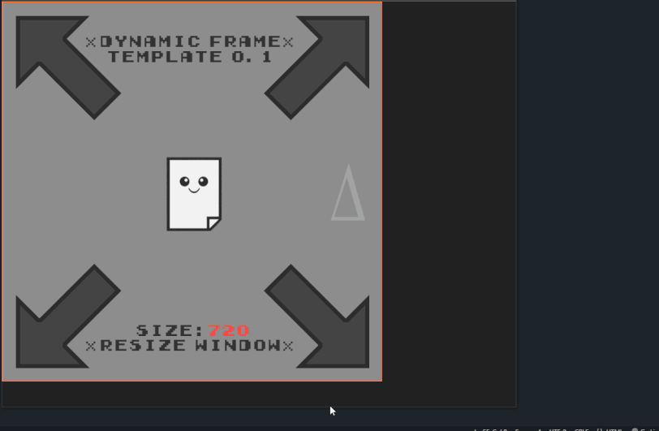

# LRC-NFT-DynamicFrame
A dynamic-frame template for canvas/html-based NFT dev on Loopring L2.

# Getting Started

Want to learn how to make your first interactive NFT? 

Or just want an intro to get started with the Dynamic Frame NFT Template? 

[tutorial coming soon]

# About
This template is designed to scale a html/canvas NFT to display at the ideal size in _any_ wallet.

This has been an issue I've run into given the lack of consistency between different wallet types we have now, its hard to know what size to set a canvas - so why not dynamically scale it for any wallet specifications?? Going into the future we dont know wallet sizes will be supported or standard. So this is my setup to plan ahead and future-proof a little for canvas/html based NFTs.

This template (by default) scales between a minimum of 64px (note the GME wallet display size as of JUNE '22 is 320px) and maximum of 720px (for higher res requirements), but it can be modified easily as needed. **As of v0.2** Ive added fullscreen functionality to the template as well, which overrides any of these limits and fills the entire area the NFT is hosted within.

**Feedback Welcome!! (and appreciated)**

Alex.Delderfield@gmail.com

https://twitter.com/Alex_ADEdge

[delta-edge.com](http://www.delta-edge.com/)

delta.loopring.eth

Feel free to use for your own html/canvas NFT needs.

Just credit me **(Alex Delderfield - twitter.com/Alex_ADEdge)** somewhere/sometime, and be sure to show me any neat NFTs this helps you make :D

# Version History & Notes

## Version 0.2 (WIP)

-Resizing of nftBOX element (main container) based on whichever dimension is smallest (width vs height). This means the NFT will now resize based on either a horizontal OR vertical constraint being the smallest, rather than only the vertical height as it was in v0.1 (typical to web dev I found there was no standard implemented here, some sites/wallets constrain the size of the NFT based on width, some on height, so the best solution is to allow for both). Note that doing this with pure CSS is a nightmare, so I'm just brute-forcing the resize with Javascript now

-Fullscreen toggle button added which further aids future-proofing. This also breaks the size limitations when enabled - making the template more flexible overall

-NFT scale limits also changed, minimum size is now 64px, maximum size is still 720px (but of course is overridden when in fullscreen mode)

-Reworked delta symbol/link example, also disables when doco element is being dragged

-Some minor fixes and improvements to various elements

-Centering of main div within body element, so your NFT will center on any page its rendered on (looking at you, new GME fullscreen mode)

## Version 0.1 (21/06/2022)

See [**here for a dynamic demo**](http://delta-edge.com/DynamicFrameDemo/) (best to open this demo and resize the window to see the rescale in action)

Or see [**here for a version minted on Loopring L2**](https://lexplorer.io/nfts/0x22b60c6ff19b6590216d5a45a96de404cd1897d3-0-0xfe23138c751c8146f2787738ba63333240508901-0xd5cf18b4c18caabc96610b6cec708b99470140a339dd1eae8697321da0b61a8d-5) (which will auto-scale to 512 in lexplorer)

Initial version features:

-Dynamic div scaling (to fit L2 wallets past present and hopefully future)- the best way I've found to do this is create a 'container' div _(nftBOX)_ which has the CSS **'min-height: 320px; min-width: 320px; max-height: 720px; max-width: 720px; height: 100%; aspect-ratio: 1/1;'** - these values are **key**. The canvas is setup within this container div, with width and height set to 100%. A javascript function handles the dynamic window resize (might not ever happen for an NFT but still handy to have just in case) + keeps all elements at a relative scale (so everything within the NFT scales to fit the NFT size in different wallets)

-'Doco'! An example character and dynamic element to demonstrate some interactivity

-A 'smoothly' scaling canvas, using a temp/memory based canvas to instantly copy content back to the primary canvas when rescaling

-'Size' display, the size of the canvas is dynamically displayed in the NFT to help with debugging

-Demo custom font & font loading

****Testing and feedback needed**

**Known issues in v0.1 & questions for v0.2:**

~~-aspect-ratio not supported in IE (fine in Chrome/Firefox/Edge)~~

-touch screen functionality broken for 'Doco' element

~~Question TBD - Should the template scale based on horizontal constraints or vertical? (currently set to scale based on the vertical height of the wallet's div which contains the NFT content) but it could alternatively scale based on horizontal space. Or whichever is smallest?~~

~~Question TBD - Maximum (720px) and minimum (320px) sizes, should there be a min and max? Are these values ok as a default?~~

Question TBD - Any overall design choices which are flawed or I've gotten wrong?
